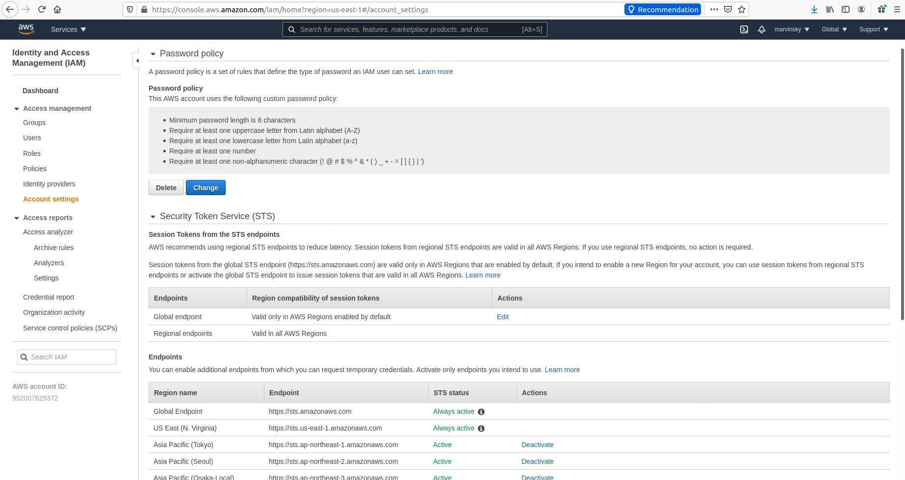

Project 2 in the Udacity AWS Cloud Architect nanodegree

Plan, design, provision, and monitor infrastructure in AWS using industry-standard and open source tools. Practice the skills you have learned throughout the course to optimize infrastructure for cost and performance. Use Terraform to provision and configure AWS services in a global configuration.

Project files from [here](https://github.com/Marvinsky/aws_design_provision_monitor_infraestructure_scale).

<h3>Before you get started</h3>

*   [AWS CLI](https://aws.amazon.com/es/cli/).

*   [Terraform](https://www.terraform.io/).

You will also need user accounts for AWS and Terraform.

<h3>Permissions</h3>
The task carried out for this project should be carried out by a user logged in with the IAM role of Administrator with access to Billing information. You can learn more about setting up a user with the Admin role here: 

[Creaating Your First Admin User and Group](https://www.terraform.io/).

<h2>Task 1: Create AWS Architecture Schematics</h2>

<h5>Part 1</h5>

[`Udacity_Diagram_1.pdf`](resources/Udacity_Diagram_1.pdf)

<h5>Part 2</h5>

[`Udacity_Diagram_2.pdf`](resources/Udacity_Diagram_2.pdf)

<h2>Task 2: Calculate Infraestructure Costs</h2>

<ol>
<li>Estimate how much it will cost to run the services in your Part 1 diagram for one month.
<ul>
<li>Target a monthly estimate between $8,000-$10,000</li>
<li>Be mindful of AWS regions when you are estimating costs</li>
</ul>

[`Initial_Cost_Estimate.csv`](resources/Initial_Cost_Estimate.csv)
</li>
<li>Configure your estimates for the following scenarios:
<ul>
    <li>Your budget has been reduced from $8,000-$10,000 to a maximum of $6500. What services will you modify to meet this new budget?</li>

<h4>How I reduced the estimate to $6,500?</h4>

[`rational.txt`](resources/estimated_decreased.txt) 

[`Reduced_Cost_Estimate.csv`](resources/Reduced_Cost_Estimate.csv) 

<li>Your budget has been increased to $20,000. What resources will you add and why? Think about where to add redundancy and how to improve performance. Re-configure your estimate to a monthly invoice of $18K-$20k.
</li>

<h4>How I come up with an estimated cost of $20,000?</h4>

[`rational.txt`](resources/estimated_increased.txt) 

[`Increased_Cost_Estimate.csv`](resources/Increased_Cost_Estimate.csv) 
</ul>
</li>
</ol>

<h2>Task 3: Configure Permissions</h2>

In order to complete this task, please ensure your IAM have been granted access to the billing dashboard

Main Account

User Account created

<h2>Task 3: CloudTrail Information</h2>

[`UdacityCloudTrailLog.csv`](resources/UdacityCloudTrailLog.csv) 

<h2>Task 4: Set up Cost Monitoring</h2>

The reason why cloudWatch log display insufficient data is because for the set period no logs have been received. Look at the billing:

<h2>Task 5:</h2>

### Exercise 1

1. Review the directories Exercise_1 and Excersive_"
2. In the main.tf file write the code to provision
   * AWS as the cloud provider
   * Use an existing VPC ID
   * Use an existing public subnet
   * 4 AWS t2.micro EC2 instances named Udacity T2
   * 2 m4.large EC2 instances named Udacity M4
3. Run Terraform. 
4. Take a screenshot of the 6 EC2 instances in the AWS console and save it as `Terraform_1_1`.

5. Use Terraform to  delete the 2 m4.large instances 
6. Take an updated screenshot of the AWS console showing only the 4 t2.micro instances and save it as `Terraform_1_2`

### Exercise 2

1. In the  Exercise_2 folder, write the code to deploy an AWS Lambda Function using Terraform. Your code should include:

   * A lambda.py file
   * A main.tf file with AWS as the provider, and IAM role for Lambda, a VPC, and a public subnet
   * An outputs.tf file
   * A variables.tf file with an AWS region
  
2. Take a screenshot of the EC2 instances page

3. Take a screenshot of the VPC page 

4. CloudWatch log entry

<h2>Task 6: Destroy infraestructure using terraform.</h2>

Making sure about destroying EC2 instances.

